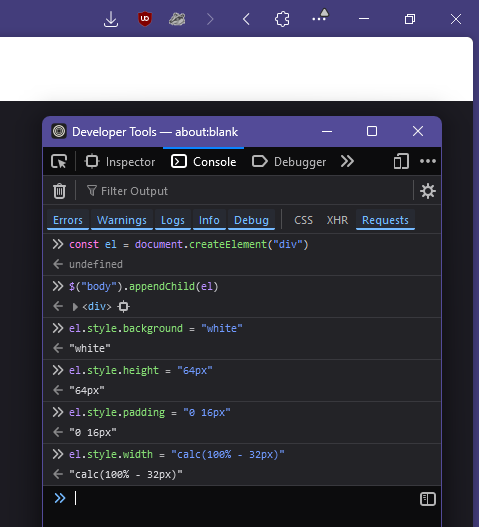
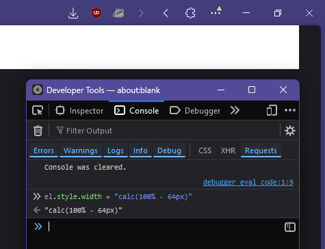
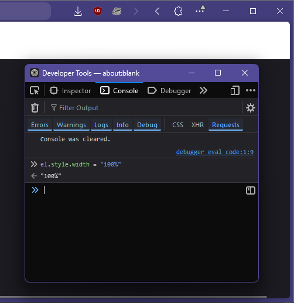
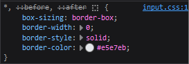
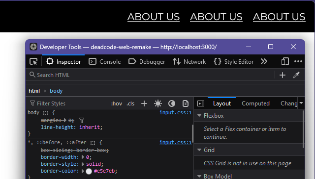

# Tailwind "Fuck Off, Border Box!" Plugin ××
###### Version 1.0.0

## Why does this exist?
The date was January 23rd 2025, around 8:30PM CET.

I (the author of this plugin, @RichardKanshen on GitHub, haiii :3) was working with @Hoshty on a redesign and rewrite of our website from plain HTML and CSS to React and Tailwind.

We started off with a header. Plain, and simple. Here is the rough design.


###### Yes, there are three About Us links, the design was rushed just to put something on the Figma design, don't judge me.
We have decided on padding of 16px on both the right and left side of the header. Nothing special.
> "So, you're gonna want to add 16px of padding, that is `px-4`, because you divide by 4." - R

Great, and padding there was. And then came the width.

I, as someone who used to work with plain CSS for way longer than Tailwind, was used to using `calc()` for widths and heights, because you have to account for padding... Right?
> "And for the width, you're gonna want to use `w-[calc(100%-32px)]`, because 16 pixels on both sides, that is 32 pixels. Substract that from the 100% width of the app container." - R

> "Yep, got it" - H

So, Hošty added the class, and saved the file, before switching to Zen.
And, that's when we saw...


You see it, right?


I was slightly confused by this. 16px of padding on both the right and the left is 32px altogether, which means we need 100% - 32px of width. So, I made a mock in a new about:blank tab, with the same width setting. And, as expected...



So, I tried something else.


###### Alright, we are too short.

And something else...


###### As expected, we have overflow.

At this point, I had no idea why his version was apparently doing maths wrong. So... I went to bed.

I did not havethe mental energy to deal with this.

> "I'll take a look at it tomorrow at school, this got me fucked up." - R

> "Alright" - H

And so, 13 hours later, Hoshty took out his laptop before maths class, and spun up the local dev server. We tinkered around in the inspector for a bit, before I noticed this.



I had no idea why that was there, but I decided to try it. And so I disabled the `box-sizing: border-box` rule.



It took me 13 hours to figure out that this one simple line broke my workflow with CSS size maths.

### Conclusion
Richard is a dumbass. Do not trust him with CSS maths in Tailwind unless you are using `@dead404code/tailwind-fuck-off-border-box` or setting `box-sizing` to `content-box` manually.

## Table of Contents

- [Installation](#installation)
- [Usage](#usage)
- [Available Utilities](#available-utilities)
- [Contributing and Issues](#contributing-and-issues)
- [License](#license)

## Installation

To install the package, you can use npm:

```bash
npm install --save-dev @dead404code/tailwind-remove-base-border-box
#
npm install --save-dev git+https://github.com/DeadCodeGames/tailwind-FuckOffBorderBox.git
```

## Usage

To use the utilities provided by this package, you need to include it in your Tailwind CSS configuration. Here’s how you can do it:

1. Open your **`tailwind.config.js`** file.
2. Add the plugin to your configuration:

```JS
const tailwindFuckOffBorderBox = require('@dead404code/tailwind-remove-base-border-box');

module.exports = {
  // other configurations...
  plugins: [
    tailwindFuckOffBorderBox,
    // other plugins...
  ],
};
```
3. `box-sizing` will now be set to `content-box`, the default browser behaviour, on all elements (unless you override that behaviour)

## Contributing and Issues
Contributions are welcome! If you have suggestions for improvements or new utilities, feel free to [open an issue](https://github.com/DeadCodeGames/tailwind-FuckOffBorderBox/issues) or [submit a pull request](https://github.com/DeadCodeGames/tailwind-FuckOffBorderBox/pulls).

If you encounter any bugs or have feature requests, please report them in the [issues section](https://github.com/DeadCodeGames/tailwind-FuckOffBorderBox/issues).

## License

This project is licensed under the [WTFPL](https://en.wikipedia.org/wiki/WTFPL) (Do What The Fuck You Want To Public License). You are free to copy, modify, and distribute this package as you wish.